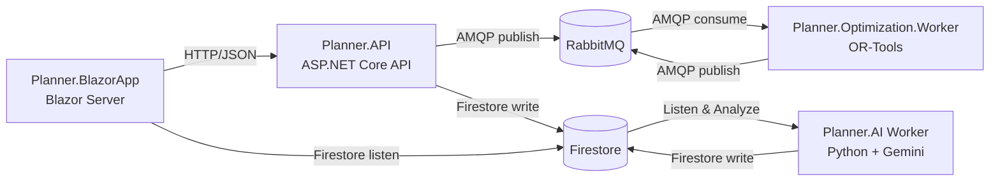

<picture>
  <source media="(prefers-color-scheme: dark)" srcset="assets/banner-dark.svg">
  <source media="(prefers-color-scheme: light)" srcset="assets/banner-light.svg">
  
</picture>

# Planner

Planner is a modular fleet planning / optimization playground built with **.NET 8**. It demonstrates a production-minded **Clean Architecture** approach to:

- map-centric dispatching (customers, jobs, vehicles, depots)
- asynchronous optimization with background workers
- real-time result delivery (Firestore)
- multi-tenant isolation and auth boundaries
- optional AI-powered route insights

## Overview

### What you can do

- Maintain **customers/jobs/vehicles/depots** in a Dispatch Center UI.
- Run **VRP optimization** asynchronously (API publishes a job, worker solves with OR-Tools).
- Observe **real-time updates** of optimization progress/results in the UI.
- View **AI-generated route insights** (optional) produced by a Python worker using Gemini.

### Why this repo exists

This repo is a learning and experimentation playground for:

- Clean Architecture boundaries in a multi-project .NET solution
- async messaging patterns (BFF-style API boundary + background worker)
- practical multi-tenancy (claim → middleware → EF Core filters → messages)
- “real-time but decoupled” UI updates using Firestore

## Architecture & System Design

### System diagram



### Key design choices (from completed work)

- **DTO-only API contracts**: API returns/accepts `Planner.Contracts` DTOs (closed: #3).
- **Solid Blazor state + cache synchronization**: UI state management follows explicit interfaces and refresh-on-change patterns (closed: #5).
- **Tenant metadata registry**: UI can bootstrap tenant context (name + main depot) after login (closed: #8).
- **Async optimization pipeline polish**: improved summary endpoints/UI workflows around jobs and optimization UX (closed: #31, #36).
- **Result delivery evolution**: Firestore is used for real-time results/insights delivery; SignalR usage was replaced for the API→UI result channel in favor of Firestore-based flow (closed: #49).
- **GraphQL capability**: GraphQL was introduced in `Planner.API` and consumed from the Blazor app for richer queries (closed: #51).
- **AI worker integration**: Python worker + Firestore collections enable route insights (closed: #43).
- **Authentication persistence**: HTTP-only cookie/BFF-style persistence was implemented to improve session security and UX (closed: #22).
- **Identity provider migration**: Entra ID (Azure AD) “External ID” migration work completed (closed: #53).

## Technology Stack

| Layer | Technology | Notes |
|------|------------|------|
| UI | Blazor Server (.NET 8) | Map-centric Dispatch Center |
| API | ASP.NET Core (.NET 8) | REST + GraphQL (closed: #51) |
| Auth | JWT + role policies + BFF cookie persistence | Cookie persistence (closed: #22) |
| Messaging | RabbitMQ (AMQP) | Decouple API and optimizer |
| Optimization | Google OR-Tools | VRP solving in worker |
| Persistence | SQL Server + EF Core | Explicit migrate/seed tooling |
| Real-time | Google Firestore | UI listens for results; pending_analysis + route_insights |
| AI (optional) | Python worker + Gemini | Route insights (closed: #43) |
| CI/CD | GitHub Actions | Azure deploy pipelines |

## Multi-tenancy (PaaS boundary)

Multi-tenancy is enforced across storage, API, and realtime updates:

- **JWT claim**: tokens include `tenant_id`.
- **Request tenant context**: middleware sets `ITenantContext`.
- **EF Core query filters**: tenant-scoped entities are filtered by `TenantId` at the DbContext level.
- **Messaging scoping**: optimization requests/results carry `TenantId` end-to-end.
- **Realtime isolation**: Firestore documents are written with tenant context.

## Features

- Map-based Dispatch Center UI for customers/jobs/vehicles/depots
- Multi-tenant boundary enforced by claims + middleware + EF Core query filters
- CRUD APIs using DTO contracts (closed: #3)
- Async optimization job execution with RabbitMQ + background worker
- Optimization UX improvements (summary endpoints and UI flows) (closed: #31, #36)
- Firestore-based real-time results delivery (closed: #49)
- GraphQL API + Blazor client usage (closed: #51)
- AI-powered route insights via Python worker + Firestore (closed: #43)
- BFF / HTTP-only cookie auth persistence (closed: #22)

## Roadmap

The high-level direction is to keep Planner as a realistic-but-approachable playground.

- Observability: structured logging + tracing across API/worker
- More solver strategies: add metaheuristics (ALNS/GA) alongside OR-Tools baselines
- Better domain modeling for job constraints (time windows, skills, breaks)
- Multi-tenant ops: tenant admin UX and safer data lifecycle tooling
- Security hardening: replace demo password checks with identity provider-only login where applicable

## Changelog (high-level)

> This is a human-readable summary derived from closed issues. For exact details, see each issue.

### 2026-02

- Authentication persistence via BFF / HTTP-only cookies (#22)
- Firestore-based realtime delivery between API and Blazor app (#49)
- GraphQL added to `Planner.API` and consumed from `Planner.BlazorApp` (#51)
- Planner.AI worker added for route insights analysis (#43)
- Entra ID External ID migration (#53)
- Demo login UX improvements (default city/email + display demo password) (#45, #55)

### 2026-01

- Demo polish and UX fixes around routing build panel and optimization result rendering (#36)
- RoutingResultDto enrichment + mapping refactor for frontend listing (#34, #47)
- Optimization contract refactors (units + flattened matrices) (#24, #26)
- Tenant metadata registry for bootstrap and main depot preference (#8)
- Blazor state/cache sync improvements (#5)
- DTO-only API boundaries enforced (#3)
- Customer maintenance improvements via map interactions (#1)
- Google Maps loading emergency fix (#13)

## Engineering Philosophy

- **Boundaries first**: contracts (DTOs/messages) are explicit and versionable.
- **Async by default** for long-running compute: solve requests are jobs, not blocking HTTP calls.
- **Tenant isolation is non-negotiable**: tenant id is carried end-to-end.
- **Operational safety**: migrations/seeding are explicit and CI/CD-friendly.
- **UI resilience**: state management favors refresh-on-change and predictable cache sync.

## Local development

### Prerequisites

- .NET SDK `8.0.x`
- RabbitMQ (Docker is easiest)
- SQL Server (LocalDB, SQL Express, or Docker)
- A Google Maps API key (for the map view)
- **Optional**: Python 3.9+ for AI insights (see `src/Planner.AI/README.md`)
- **Optional**: Google Cloud Firestore and Gemini API key for AI insights

### Start dependencies (Docker)

RabbitMQ:
```bash
docker run -d --name planner-rabbitmq --hostname planner-rabbitmq --restart unless-stopped \
  -p 5672:5672 -p 15672:15672 rabbitmq:3-management
```

SQL Server (optional if you use LocalDB):
```bash
docker run -d --name planner-sql --restart unless-stopped \
  -e "ACCEPT_EULA=Y" -e "MSSQL_SA_PASSWORD=Your_password123" \
  -p 1433:1433 mcr.microsoft.com/mssql/server:2022-latest
```

### Configure required settings

`Planner.API` fails fast if required configuration is missing.
For local dev, the simplest is environment variables or the Visual Studio launch profiles.

PowerShell example:
```powershell
$env:ConnectionStrings__PlannerDb = "Data Source=localhost;Initial Catalog=PlannerDB;Integrated Security=True;Encrypt=False;TrustServerCertificate=True;"
$env:RabbitMq__Host = "localhost"
$env:RabbitMq__Port = "5672"
$env:RabbitMq__User = "guest"
$env:RabbitMq__Pass = "guest"
$env:JwtOptions__Issuer = "planner-local"
$env:JwtOptions__Audience = "planner-local"
$env:JwtOptions__SigningKey = "dev-signing-key-change-me-dev-signing-key"
$env:JwtOptions__Secret = "dev-secret-change-me-dev-secret-change-me"

$env:Api__BaseUrl = "https://localhost:7085/"
$env:GoogleMaps__ApiKey = "<your-google-maps-api-key>"
$env:GoogleMaps__MapId = "<optional-google-map-id>"

# Optional: Firestore configuration for real-time updates
$env:Firestore__ProjectId = "<your-firebase-project-id>"
$env:FIREBASE_CONFIG_JSON = "<base64-encoded-firebase-credentials-or-raw-json>"
```

### Prepare the database

```bash
dotnet run --project tools/Planner.Tools.DbMigrator migrate
dotnet run --project tools/Planner.Tools.DbMigrator seed
```

The seed scripts create multiple demo tenants (cities) and demo users.

### Run the services

In separate terminals:
```bash
dotnet run --project src/Planner.API
dotnet run --project src/Planner.Optimization.Worker
dotnet run --project src/Planner.BlazorApp

# Optional: AI insights worker (requires Firestore + Gemini setup)
cd src/Planner.AI && python planner_ai_worker.py
```

Typical URLs (from current launch profiles):
- UI: `https://localhost:7014`
- API: `https://localhost:7085`
- RabbitMQ UI: `http://localhost:15672`

### Demo login

The Blazor login page (`/login`) is pre-filled with a seeded demo admin:
- Email: `christchurch.admin@demo.local`
- Password: `admin123`

## Screenshots


## License

This project is licensed under the MIT License.