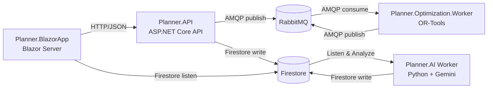

<picture>
  <source media="(prefers-color-scheme: dark)" srcset="assets/banner-dark.svg">
  <source media="(prefers-color-scheme: light)" srcset="assets/banner-light.svg">
  
</picture>

# Planner

Planner is a modular fleet planning / optimization playground built with **.NET 8**:

- **UI**: `Planner.BlazorApp` (Blazor Server) with a map-centric Dispatch Center
- **API**: `Planner.API` (ASP.NET Core) for CRUD + optimization commands
- **Worker**: `Planner.Optimization.Worker` (BackgroundService) running **Google OR-Tools**
- **Messaging**: RabbitMQ decouples API and optimizer
- **Data**: SQL Server (**EF Core**) with explicit migrate/seed tooling
- **PaaS-ready**: JWT auth + role-based authorization + **multi-tenant isolation**

## Why the README changed over time

The earlier README focused on the UI (Dispatch Center) and the solver data-flow, and referenced JSON-in-`wwwroot` demo persistence.
The current repo has moved to:
- **EF Core + SQL Server** for persistence (with migrations + seed scripts)
- **JWT authentication/authorization**
- **Multi-tenancy** as a first-class boundary (TenantId carried end-to-end)
- **GitHub Actions CI/CD** for Azure deployments

This README reflects the current situation.

## Architecture



### AI-Powered Route Insights (New!)

The Planner now includes an **AI-powered route insights** feature:

1. **API** sends optimization results to Firestore (`pending_analysis` collection)
2. **BlazorApp** listens to Firestore and receives optimization results in real-time
3. **Planner.AI Worker** (Python) listens to Firestore, analyzes results with Google Gemini AI, and writes insights to `route_insights` collection
4. **BlazorApp** listens to `route_insights` and displays AI-generated markdown insights in a popup modal

**Setup**: See `src/Planner.AI/README.md` for detailed setup instructions.

## Project architecture summary

### Product manager view

- **User experience**: a Dispatch Center UI for managing fleets/jobs and running an optimization to generate routes and assignments.
- **System behavior**: “Solve” is asynchronous; the UI requests a solve, the optimizer runs in the background, and the UI receives progress/results via real-time updates.
- **Scalability**: the optimizer is a separate worker and can scale independently from the API/UI based on optimization load.
- **Tenant isolation**: multi-tenancy is an end-to-end boundary (JWT → API → database → Firestore → optimization messages).
- **Release safety**: database changes are explicit (migrate/seed tooling and CI/CD) to reduce deployment risk.

### Senior developer view

- **Runtime topology**: `Planner.BlazorApp` ↔ `Planner.API` (HTTP), `Planner.API` ↔ `Planner.Optimization.Worker` (RabbitMQ AMQP), real-time updates via Firestore.
- **Layering**: `Planner.Domain` (model), `Planner.Application` (use cases), `Planner.Infrastructure` (EF Core/auth/adapters), with host projects for API/UI/Worker.
- **Contracts**: `Planner.Contracts` for API DTOs and `Planner.Optimization.Contracts` for queue message payloads to keep boundaries explicit and versionable.
- **Multi-tenancy**: `tenant_id` claim drives tenant context, EF Core query filters, and message payload scoping.
- **Database lifecycle**: migrations and append-only seed scripts run via `tools/Planner.Tools.DbMigrator`; runtime auto-migrate is intentionally avoided.

## Multi-tenancy (PaaS boundary)

Multi-tenancy is enforced across storage, API, and realtime updates:

- **JWT claim**: tokens include `tenant_id` (see `src/Planner.Infrastructure/Auth/JwtTokenGenerator.cs`).
- **Request tenant context**: `TenantContextMiddleware` sets `ITenantContext` from the JWT claim (see `src/Planner.API/Middleware/TenantContextMiddleware.cs`).
- **EF Core query filters**: tenant-scoped entities are filtered by `TenantId` at the DbContext level (see `src/Planner.Infrastructure/Persistence.PlannerDbContext.cs`).
- **Firestore isolation**: optimization results are stored with tenant context for proper data isolation.
- **Optimization messages**: requests/results carry `TenantId` through RabbitMQ and the worker.

## Authentication & authorization

- **Auth**: JWT Bearer authentication (see `src/Planner.Infrastructure/ServiceRegistration.cs`).
- **Roles**: role claim is `ClaimTypes.Role` and is used for policies.
- **Admin policy**: `/api/vrp/solve` is protected by `AdminOnly` (see `src/Planner.API/Controllers/OptimizationController.cs`).

Demo note: `AuthController` currently uses a demo password check (plain-text comparison). For a real PaaS, replace this with a proper password hashing/identity implementation.

## EF Core + database lifecycle

- `PlannerDbContext` lives in `src/Planner.Infrastructure/Persistence.PlannerDbContext.cs`.
- Migrations are in `src/Planner.Infrastructure/Migrations/`.
- The **API does not migrate or seed at runtime** (see `.github/WORKFLOWS.md`); database changes are explicit.

### DbMigrator tool (migrate + seed)

Use `tools/Planner.Tools.DbMigrator`:

```bash
dotnet run --project tools/Planner.Tools.DbMigrator migrate
dotnet run --project tools/Planner.Tools.DbMigrator seed
```

Seed scripts are **append-only** and tracked via `__SeedHistory` (see `tools/Planner.Tools.DbMigrator/SeedScripts/README.md`).

## Repository layout

- `src/Planner.BlazorApp` - Blazor UI (map + Dispatch Center)
- `src/Planner.API` - API + background consumers
- `src/Planner.AI` - **Python AI worker** for route insights analysis using Google Gemini
- `src/Planner.Application` - use cases and orchestration services
- `src/Planner.Domain` - core domain model
- `src/Planner.Contracts` - API-facing DTO contracts
- `src/Planner.Optimization.Worker` - queue consumer + solver execution
- `src/Planner.Optimization` - OR-Tools VRP implementation
- `src/Planner.Optimization.Contracts` - optimizer request/result message contracts
- `src/Planner.Messaging` - RabbitMQ connection + message bus
- `src/Planner.Infrastructure` - EF Core, auth, hosted services, cross-cutting wiring
- `tools/Planner.Tools.DbMigrator` - EF Core migrate + seed runner
- `test/` - unit/integration/end-to-end test projects
- `.github/workflows/` - CI/CD pipelines

## Local development

### Prerequisites

- .NET SDK `8.0.x`
- RabbitMQ (Docker is easiest)
- SQL Server (LocalDB, SQL Express, or Docker)
- A Google Maps API key (for the map view)
- **Optional**: Python 3.9+ for AI insights (see `src/Planner.AI/README.md`)
- **Optional**: Google Cloud Firestore and Gemini API key for AI insights

### Start dependencies (Docker)

RabbitMQ:
```bash
docker run -d --name planner-rabbitmq --hostname planner-rabbitmq --restart unless-stopped \
  -p 5672:5672 -p 15672:15672 rabbitmq:3-management
```

SQL Server (optional if you use LocalDB):
```bash
docker run -d --name planner-sql --restart unless-stopped \
  -e "ACCEPT_EULA=Y" -e "MSSQL_SA_PASSWORD=Your_password123" \
  -p 1433:1433 mcr.microsoft.com/mssql/server:2022-latest
```

### Configure required settings

`Planner.API` fails fast if required configuration is missing (see `src/Planner.API/Program.cs`).
For local dev, the simplest is environment variables or the Visual Studio launch profiles.

PowerShell example:
```powershell
$env:ConnectionStrings__PlannerDb = "Data Source=localhost;Initial Catalog=PlannerDB;Integrated Security=True;Encrypt=False;TrustServerCertificate=True;"
$env:RabbitMq__Host = "localhost"
$env:RabbitMq__Port = "5672"
$env:RabbitMq__User = "guest"
$env:RabbitMq__Pass = "guest"
$env:JwtOptions__Issuer = "planner-local"
$env:JwtOptions__Audience = "planner-local"
$env:JwtOptions__SigningKey = "dev-signing-key-change-me-dev-signing-key"
$env:JwtOptions__Secret = "dev-secret-change-me-dev-secret-change-me"

$env:Api__BaseUrl = "https://localhost:7085/"
$env:GoogleMaps__ApiKey = "<your-google-maps-api-key>"
$env:GoogleMaps__MapId = "<optional-google-map-id>"

# Optional: Firestore configuration for real-time updates
$env:Firestore__ProjectId = "<your-firebase-project-id>"
$env:FIREBASE_CONFIG_JSON = "<base64-encoded-firebase-credentials-or-raw-json>"
```

### Prepare the database

```bash
dotnet run --project tools/Planner.Tools.DbMigrator migrate
dotnet run --project tools/Planner.Tools.DbMigrator seed
```

The seed scripts create multiple demo tenants (cities) and demo users.

### Run the services

In separate terminals:
```bash
dotnet run --project src/Planner.API
dotnet run --project src/Planner.Optimization.Worker
dotnet run --project src/Planner.BlazorApp

# Optional: AI insights worker (requires Firestore + Gemini setup)
cd src/Planner.AI && python planner_ai_worker.py
```

Typical URLs (from current launch profiles):
- UI: `https://localhost:7014`
- API: `https://localhost:7085`
- RabbitMQ UI: `http://localhost:15672`

### Demo login

The Blazor login page (`/login`) is pre-filled with a seeded demo admin:
- Email: `christchurch.admin@demo.local`
- Password: `admin123`

Other demo tenants: `sydney`, `melbourne`, `taipei`, `auckland`, `perth` (replace the prefix in the email).

## CI/CD (GitHub Actions)

Workflows live in `.github/workflows/` and are designed for an Azure dev environment.
They use **Azure OIDC** (`azure/login@v2`) instead of storing service principal secrets.

- `db-migrator-dev.yml`
  - Builds `tools/Planner.Tools.DbMigrator`
  - Runs `migrate` then `seed`
  - Has a safety check to refuse running against non-dev targets
- `deploy-planner-api-aca.yml`
  - Builds and pushes `src/Planner.API/Dockerfile` to ACR
  - Updates an Azure Container App and injects required env vars (DB, RabbitMQ, Firestore, JWT)
- `deploy-planner-optimization-worker-aca.yml`
  - Builds and pushes `src/Planner.Optimization.Worker/Dockerfile` to ACR
  - Updates an Azure Container App and injects RabbitMQ env vars
- `main_planner-blazor-dev.yml`
  - Builds/publishes `Planner.BlazorApp`
  - Deploys to Azure App Service (`azure/webapps-deploy@v3`)

## Screenshots


## Solved Issues

This section summarizes the key issues that have been resolved in the Planner project:

### 1. [EMERGENCY] Fix broken Google Map loading (#13)
**Type:** Bug  
**Status:** Closed  
**Solution:** Fixed a race condition in Google Map loading by:
- Moving map loading to App level
- Using TaskCompletionSource as a mutex for all Google Maps operations
- Implementing googleMapsPromise as a JS level mutex

This resolved critical issues where the Google Map failed to load or display properly, restoring core functionality for map-based features.

### 2. Implement Tenant Metadata Registry (#8)
**Type:** Enhancement  
**Status:** Closed  
**Solution:** Implemented a comprehensive tenant metadata registry with:
- `TenantDto` contract with tenant ID, name, and main depot reference
- `/api/tenants/metadata` endpoint for retrieving tenant metadata
- `ITenantState` interface following existing state management patterns
- `DispatchCenterState.Tenant.cs` partial class implementation
- Auto-load tenant metadata during initialization before fetching entities
- Depot selection now prefers tenant's main depot

This enhancement enables automatic retrieval of tenant details after login and proper initialization of tenant-scoped entities (vehicles, customers, jobs).

### 3. Make BlazorApp Implementation Solid (#5)
**Type:** Enhancement  
**Status:** Closed  
**Solution:** Improved BlazorApp resilience and clarity through:
- Synchronized cache of vehicles, customers, jobs, and depots with CRUD APIs
- Separated interface injections for domain entities
- DataChanges notifications sent to both dashboard and editor modules
- Robust error handling with entity refresh and clear error messages
- Clean separation of concerns for various domain entities

These changes prevent stale data, improve user experience, and ensure actionable feedback for API failures.

### 4. Refactor API Controllers to Use DTOs (#3)
**Type:** Enhancement  
**Status:** Closed  
**Solution:** Enforced architectural best practices by:
- Defining DTO records in `Planner.Contracts`
- Creating mapping classes in `Planner.API` and `Planner.BlazorApp`
- Ensuring API and BlazorApp no longer directly access Domain objects
- All API endpoints exclusively accept/return DTOs

This refactoring promotes:
- Separation of Concerns (SoC)
- Encapsulation (Information Hiding)
- Single Responsibility Principle (SRP)

### 5. Improve Customer Maintenance (#1)
**Type:** Enhancement  
**Status:** Closed  
**Solution:** Enhanced customer maintenance workflow with map-based interactions:
- Add new customers via Ctrl+Click on map locations
- Delete customers by selecting the marker and choosing delete from context menu
- Edit customers by selecting the marker and choosing edit from context menu
- API integration with proper notifications via NotifyCustomerChanged
- Automatic marker creation for new customers

This streamlines customer management and reduces navigation steps, making common operations accessible directly from the map interface.

## License

This project is licensed under the MIT License.
