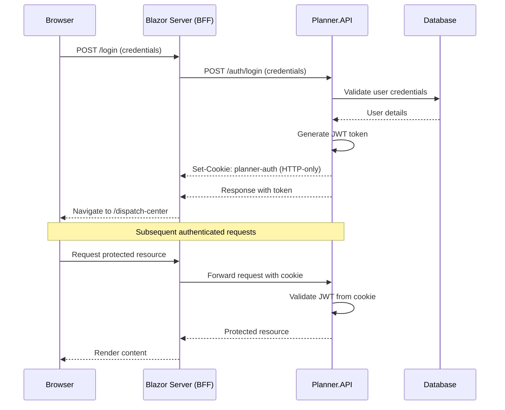

# Authentication Architecture

## Overview

Planner implements a **Backend-For-Frontend (BFF) architecture** with **HTTP-only cookies** for secure session management. This approach enhances security by preventing JavaScript access to authentication tokens while maintaining seamless session persistence across page refreshes.

## Architecture

### High-Level Flow



### Components

#### 1. **Planner.API (Backend)**
- Validates user credentials against the database
- Generates JWT tokens containing user identity, tenant ID, and role claims
- Sets HTTP-only cookies with secure configuration
- Validates JWT tokens from cookies on subsequent requests

#### 2. **Planner.BlazorApp (BFF Layer)**
- Acts as the Backend-For-Frontend layer
- Manages user sessions via HTTP-only cookies
- Forwards authenticated requests to the API backend
- Maintains token in memory for SignalR connections

## Security Features

### HTTP-only Cookies

The authentication token is stored in an HTTP-only cookie with the following security settings:

```csharp
var cookieOptions = new CookieOptions {
    HttpOnly = true,           // Prevents JavaScript access
    Secure = true,             // Requires HTTPS
    SameSite = SameSiteMode.Strict, // CSRF protection
    Expires = DateTimeOffset.UtcNow.AddDays(7), // 7-day expiration
    Path = "/",
    IsEssential = true
};
```

**Benefits:**
- **XSS Protection**: JavaScript cannot access the token, mitigating XSS attacks
- **Automatic transmission**: Browser automatically includes cookie in requests
- **Secure transmission**: Only sent over HTTPS connections
- **CSRF protection**: SameSite=Strict prevents cross-site request forgery

### CSRF Protection

The application uses ASP.NET Core's built-in antiforgery token system:
- Forms include antiforgery tokens via `<AntiforgeryToken />` component
- API validates tokens for state-changing operations
- SameSite=Strict cookie policy provides additional CSRF defense

### Session Management

- **Expiration**: Tokens expire after 7 days
- **Logout**: Explicitly clears the authentication cookie
- **Token validation**: API validates token signature, issuer, audience, and expiration on every request

## Implementation Details

### Backend (Planner.API)

#### Login Endpoint
```csharp
[HttpPost("login")]
public async Task<ActionResult<LoginResponse>> Login([FromBody] LoginRequest request) {
    // 1. Validate credentials
    var user = await db.Users.SingleOrDefaultAsync(u => u.Email == request.Email);
    if (user is null || !VerifyPassword(request.Password, user.PasswordHash))
        return Unauthorized("Invalid credentials.");

    // 2. Generate JWT token
    var token = tokenGenerator.GenerateToken(user.Id, user.TenantId, user.Role);

    // 3. Set HTTP-only cookie
    Response.Cookies.Append("planner-auth", token, cookieOptions);

    // 4. Return response
    return Ok(new LoginResponse(token));
}
```

#### Token Validation
The API supports reading JWT tokens from both Authorization headers and cookies:

```csharp
options.Events = new JwtBearerEvents {
    OnMessageReceived = context => {
        // Check Authorization header first (default)
        if (string.IsNullOrEmpty(context.Token)) {
            // Fallback to cookie
            context.Token = context.Request.Cookies["planner-auth"];
        }
        return Task.CompletedTask;
    }
};
```

#### Logout Endpoint
```csharp
[Authorize]
[HttpPost("logout")]
public IActionResult Logout() {
    Response.Cookies.Delete("planner-auth", new CookieOptions {
        HttpOnly = true,
        Secure = true,
        SameSite = SameSiteMode.Strict,
        Path = "/"
    });
    return Ok(new { Message = "Logged out successfully" });
}
```

### Frontend (Planner.BlazorApp)

#### HttpClient Configuration
The HttpClient is configured to automatically include cookies:

```csharp
builder.Services.AddHttpClient("PlannerApi", client => {
    client.BaseAddress = new Uri(builder.Configuration["Api:BaseUrl"]);
})
.ConfigurePrimaryHttpMessageHandler(() => new HttpClientHandler {
    UseCookies = true,
    CookieContainer = new System.Net.CookieContainer()
});
```

#### Login Flow
```csharp
private async Task DoLoginAsync() {
    var response = await ApiClient.PostAsJsonAsync("auth/login", loginRequest);
    
    if (response.IsSuccessStatusCode) {
        var result = await response.Content.ReadFromJsonAsync<LoginResponse>();
        
        // Store token for SignalR (not for API authentication)
        TokenStore.Set(result.AccessToken);
        
        // Cookie is automatically set by the API response
        // Navigate to protected area
        Nav.NavigateTo("/dispatch-center");
    }
}
```

#### Logout Flow
```csharp
private async Task DoLogout() {
    // Call API to clear HTTP-only cookie
    await ApiClient.PostAsJsonAsync("auth/logout", new { });
    
    // Clear local token store
    TokenStore.Clear();
    
    // Redirect to login
    Nav.NavigateTo("/login", forceLoad: true);
}
```

## SignalR Authentication

SignalR connections use the JWT token from the in-memory token store (populated during login) rather than cookies:

```csharp
_connection = new HubConnectionBuilder()
    .WithUrl(hubUrl, options => {
        options.AccessTokenProvider = () => Task.FromResult(tokenStore.AccessToken);
    })
    .Build();
```

This is necessary because SignalR WebSocket connections cannot access HTTP-only cookies from JavaScript.

## Multi-Tenancy

The JWT token includes tenant-specific claims:

```csharp
var claims = new List<Claim> {
    new("sub", userId.ToString()),
    new("tenant_id", tenantId.ToString()),
    new(ClaimTypes.Role, role)
};
```

These claims are automatically validated and available in API controllers through the `User` principal, enabling tenant isolation at the application level.

## Configuration

### Required Settings (API)

```json
{
  "JwtOptions": {
    "Issuer": "planner-api",
    "Audience": "planner-clients",
    "SigningKey": "[32+ character secret key]",
    "Secret": "[32+ character secret]",
    "ExpirationInMinutes": 10080
  }
}
```

### Required Settings (Blazor App)

```json
{
  "Api": {
    "BaseUrl": "https://localhost:7085/"
  },
  "SignalR": {
    "Server": "https://localhost:7085",
    "Route": "/hubs/planner"
  }
}
```

## Migration from Previous Architecture

### Before (JWT in Memory)
- JWT tokens stored in scoped service (`JwtTokenStore`)
- Tokens sent via Authorization header on every request
- No persistence across browser refreshes
- Tokens accessible to JavaScript (security concern)

### After (HTTP-only Cookies)
- JWT tokens stored in HTTP-only cookies
- Cookies automatically included in requests by browser
- Persistent across browser refreshes
- Tokens inaccessible to JavaScript (enhanced security)
- Token store retained for SignalR compatibility

## Security Considerations

### Production Deployment

1. **HTTPS Required**: Always use HTTPS in production for Secure cookies
2. **Strong Signing Keys**: Use cryptographically strong keys (32+ characters)
3. **Key Rotation**: Implement periodic key rotation strategy
4. **Token Expiration**: Balance security vs. user experience (currently 7 days)
5. **Secure Infrastructure**: Ensure API and Blazor app are on trusted networks
6. **CORS Configuration**: Verify CORS settings allow credentials from trusted origins only

### Known Limitations

1. **SignalR WebSockets**: Cannot use HTTP-only cookies; falls back to token store
2. **Same-Site Only**: SameSite=Strict may impact some cross-site scenarios
3. **Demo Password Validation**: Current implementation uses plain-text comparison; replace with proper password hashing (e.g., BCrypt, Argon2) for production

## Testing

### Manual Testing

1. **Login Flow**
   - Navigate to `/login`
   - Enter valid credentials
   - Verify redirect to `/dispatch-center`
   - Check browser dev tools → Application → Cookies → `planner-auth` cookie is present and HTTP-only

2. **Session Persistence**
   - Login successfully
   - Refresh the page
   - Verify still authenticated (no redirect to login)

3. **Logout Flow**
   - Click logout button
   - Verify redirect to `/login`
   - Check browser dev tools → Cookie should be deleted

4. **API Authentication**
   - Make API requests to protected endpoints
   - Verify 401 Unauthorized when not logged in
   - Verify successful response when logged in

### Automated Testing

See test projects:
- `Planner.API.EndToEndTests` for API integration tests
- `Planner.BlazorApp.Tests` for Blazor component tests

## Troubleshooting

### Cookie Not Being Set

**Symptoms**: Login appears successful, but subsequent requests return 401 Unauthorized

**Solutions**:
- Verify HTTPS is being used (Secure=true requires HTTPS)
- Check CORS configuration allows credentials
- Ensure cookie domain matches request domain
- Verify SameSite policy compatibility with your deployment

### SignalR Connection Fails

**Symptoms**: Real-time updates not working after login

**Solutions**:
- Verify token is stored in `JwtTokenStore` after login
- Check SignalR hub URL configuration
- Verify token hasn't expired
- Check browser console for WebSocket connection errors

### Session Not Persisting

**Symptoms**: User gets logged out on page refresh

**Solutions**:
- Verify cookie expiration is set correctly
- Check browser is not blocking third-party cookies
- Ensure HttpClient is configured with `UseCookies = true`
- Verify cookie path matches application routes

## Future Enhancements

- [ ] Implement sliding expiration for better UX
- [ ] Add refresh token support for long-lived sessions
- [ ] Integrate with Azure AD (Entra ID) for enterprise SSO
- [ ] Implement rate limiting for login attempts
- [ ] Add audit logging for authentication events
- [ ] Support for multiple authentication schemes (Azure AD, Google, etc.)
