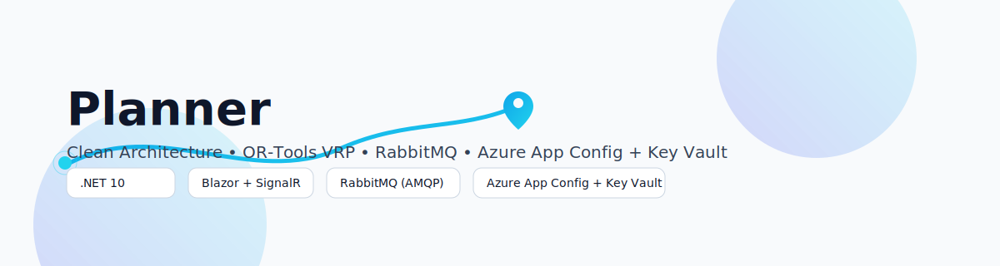
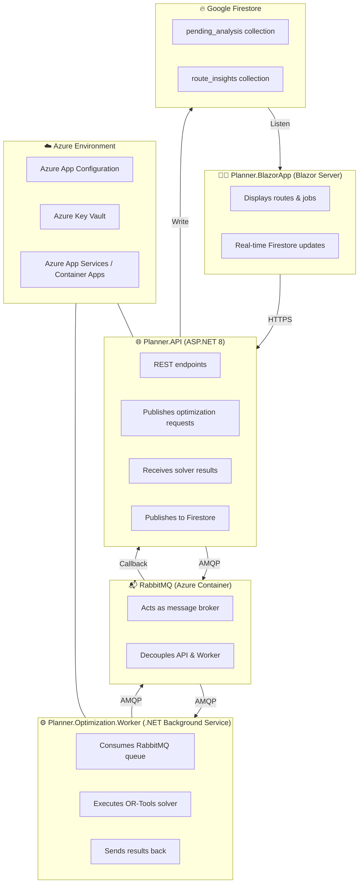
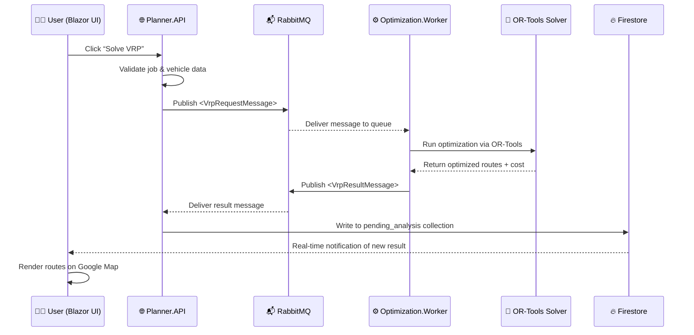

<picture>
  <source media="(prefers-color-scheme: dark)" srcset="../assets/banner-dark.svg">
  <source media="(prefers-color-scheme: light)" srcset="../assets/banner-light.svg">
  
</picture>

---

# 🧭 Planner  
**Clean Architecture • OR-Tools VRP • RabbitMQ • Azure App Config + Key Vault**

Planner is a modular, cloud-ready logistics optimization platform built with **.NET 8**, demonstrating  
**Clean Architecture**, **asynchronous optimization**, and **real-time visualization** using **Blazor** + **Firestore**.

---

## 🏗️ Infrastructure Overview

Planner applies Clean Architecture with async messaging and Azure integration.

### 🔹 System Architecture


---

### 🚦 Sequence Flow — “Solve VRP Request”


---

## ⚙️ Technology Stack

| Layer | Technology | Purpose |
|-------|-------------|----------|
| **Frontend** | 🧩 Blazor Server (.NET 8) | Interactive web UI with Firestore listeners |
| **Backend API** | 🌐 ASP.NET Core Web API | Exposes REST endpoints |
| **Messaging** | 📬 RabbitMQ (AMQP) | Decouples API and Worker |
| **Optimization** | 🧠 Google OR-Tools | Solves Linear & VRP models |
| **Background** | ⚙️ Planner.Optimization.Worker | Executes optimization jobs |
| **Real-time DB** | 🔥 Google Firestore | Real-time data sync for routes & insights |
| **Config Mgmt** | 🗂️ Azure App Configuration | Central non-secret settings |
| **Secrets** | 🔒 Azure Key Vault | Secure API keys & credentials |
| **Hosting** | ☁️ Azure App Service / Container Apps | Runs API, UI, Worker, RabbitMQ |
| **Maps** | 🗺️ Google Maps JavaScript API | Visual route display |
| **Build & Deploy** | 🧰 GitHub Actions CI/CD | Build + deploy to Azure |

---

## 🔐 Security & Configuration

### 🧱 Local Development
Sensitive values (e.g., API keys, RabbitMQ credentials) are kept **only in local files**:
```
src/Shared/shared.appsettings.json
```
These are `.gitignore`d.  
Template:  
```
src/Shared/shared.appsettings.template.json
```

### ☁️ Azure Deployment
| Source | Purpose | Example |
|--------|----------|----------|
| **App Configuration** | Shared non-secret settings | `AppConfig__Endpoint=https://planner-appconfig.azconfig.io` |
| **Key Vault** | Secrets and credentials | `@Microsoft.KeyVault(SecretUri=...)` |
| **Environment Vars** | Overrides per env | `RabbitMq__Host`, `Planner__Environment` |

All services authenticate via **Managed Identity**.

### 🧰 Local Fallback
If `shared.appsettings.json` is missing, Planner uses environment variables and logs a friendly notice.

### 🚫 Secret Policy
- No live secrets in repo or history  
- GitHub Secret Scanning enabled  
- Old keys removed via `git filter-repo` and revoked

---

## 🚀 Getting Started

### 🧩 Prerequisites
| Tool | Version | Notes |
|------|----------|-------|
| .NET SDK | 8.0+ | Build/run projects |
| RabbitMQ | 3.12+ | Local broker or Docker |
| Docker Desktop | Latest | Container support |
| Google OR-Tools | 9.x | Optimization engine |
| Google Maps API Key | — | For map rendering |
| Azure Account | — | For deployment |

### ⚙️ Local Setup
```bash
git clone https://github.com/stephen-wu-chaohui/Planner.git
cd Planner
cp src/Shared/shared.appsettings.template.json src/Shared/shared.appsettings.json
```
Edit API keys and RabbitMQ credentials.

Start RabbitMQ:
```bash
docker run -d --hostname planner-rabbit --name planner-rabbit   -p 5672:5672 -p 15672:15672 rabbitmq:3-management
```

Run projects:
```bash
dotnet run --project src/Planner.API
dotnet run --project src/Planner.BlazorApp
dotnet run --project src/Planner.Optimization.Worker
```

Open in browser:  
- UI → https://localhost:7014  
- API (Swagger) → https://localhost:5001/swagger  
- RabbitMQ UI → http://localhost:15672 (`planner / planner123`)

---

## 🌟 Project Goals & Future Enhancements

| Area | Planned Feature | Description |
|-------|-----------------|-------------|
| **Optimization** | 🧠 Metaheuristics (ALNS, GA) | Faster large-scale VRP solutions |
| **Dynamic Routing** | ⚡ Live Re-Optimization | React to traffic & order changes |
| **Data Storage** | 💾 EF Core / Dapper | Persist history for analytics |
| **Visualization** | 🗺️ Azure Maps / Leaflet | Advanced multi-layer map |
| **Analytics** | 📊 Power BI integration | Display KPI & cost metrics |
| **Authentication** | 🔐 Azure AD (Entra ID) | Enterprise SSO |
| **Observability** | 📈 App Insights + Logging | Performance & latency tracking |
| **Scalability** | ☁️ Kubernetes / ACI scale-out | Auto-scale workers by queue depth |
| **AI Extensions** | 🤖 ML travel-time prediction | Learn traffic patterns |

> “From route planning to intelligent dispatch.”

---

## 🧰 Contributing
Pull requests and ideas are welcome!  
If you’re passionate about optimization, OR-Tools, or modern .NET architecture,  
Planner is a great sandbox for experimentation.

---

## 🖼️ Logo
<picture>
  <source media="(prefers-color-scheme: dark)" srcset="../assets/logo-dark.svg">
  <source media="(prefers-color-scheme: light)" srcset="../assets/logo-light.svg">
  
</picture>

---

© 2025 Stephen Wu — Planner Project (Frank & Stephen Collaboration)
