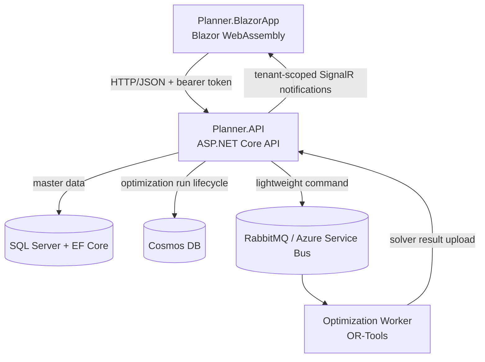
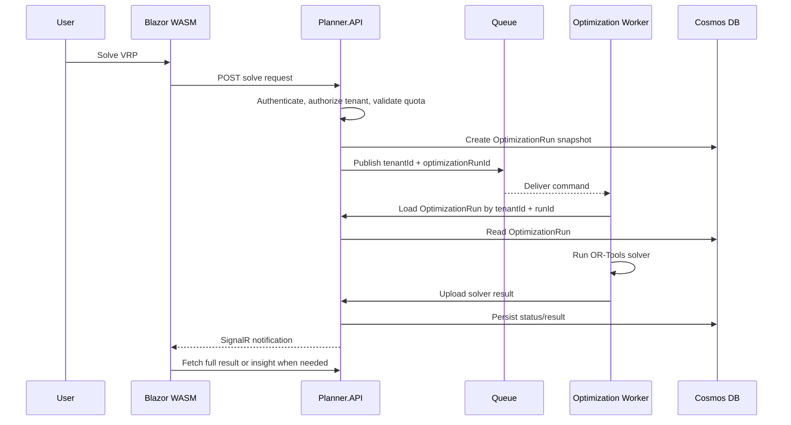

# Planner Architecture Overview

Planner is a multi-tenant route optimization platform built with .NET 10. The user-facing frontend is `Planner.BlazorApp`, a Blazor WebAssembly client that authenticates with Entra ID through MSAL and calls `Planner.API` for authoritative data.

## Current Direction

```mermaid
flowchart TD
    UI["Planner.BlazorApp<br/>Blazor WebAssembly"] -->|HTTP/JSON + bearer token| API["Planner.API<br/>ASP.NET Core API"]
    API -->|tenant-scoped SignalR notifications| UI

    API -->|master data| SQL[(SQL Server + EF Core)]
    API -->|optimization run lifecycle| COSMOS[(Cosmos DB)]
    API -->|lightweight command| BUS[(RabbitMQ / Azure Service Bus)]

    BUS --> WORKER["Optimization Worker<br/>OR-Tools"]
    WORKER -->|solver result upload| API
```

## Request Flow

```mermaid
sequenceDiagram
    participant U as User
    participant B as Blazor WASM
    participant A as Planner.API
    participant Q as Queue
    participant W as Optimization Worker
    participant C as Cosmos DB

    U->>B: Solve VRP
    B->>A: POST solve request
    A->>A: Authenticate, authorize tenant, validate quota
    A->>C: Create OptimizationRun snapshot
    A->>Q: Publish tenantId + optimizationRunId
    Q-->>W: Deliver command
    W->>A: Load OptimizationRun by tenantId + runId
    A->>C: Read OptimizationRun
    W->>W: Run OR-Tools solver
    W->>A: Upload solver result
    A->>C: Persist status/result
    A-->>B: SignalR notification
    B->>A: Fetch full result or insight when needed
```

## Technology Stack

| Layer | Technology | Purpose |
|-------|------------|---------|
| Frontend | Blazor WebAssembly | Browser-hosted Dispatch Center |
| Auth | MSAL + Entra ID | Browser login and API access tokens |
| API | ASP.NET Core | User-facing command/query control plane |
| Master data | SQL Server + EF Core | Tenants, vehicles, depots, jobs, accepted routes |
| Run lifecycle | Cosmos DB | Optimization snapshots, status, results, insights, timeline |
| Messaging | RabbitMQ and Azure Service Bus path | Lightweight optimization commands |
| Optimization | OR-Tools worker | Executes route optimization outside the API |
| Notifications | SignalR | Tenant-scoped change notifications |
| Maps | Google Maps JavaScript API | Route display |

## Configuration Notes

`Planner.BlazorApp` is static WebAssembly, so runtime settings are served from `src/Planner.BlazorApp/wwwroot/appsettings*.json`. These files are browser-visible. Do not place server secrets or client secrets there.

Required browser settings:

- `Api:BaseUrl`
- `Api:Scope`
- `AzureAd:Authority`
- `AzureAd:ClientId`
- `GoogleMaps:ApiKey`

The Azure Blazor deployment workflow generates the published `wwwroot/appsettings.json` from GitHub environment variables before `dotnet publish`.
